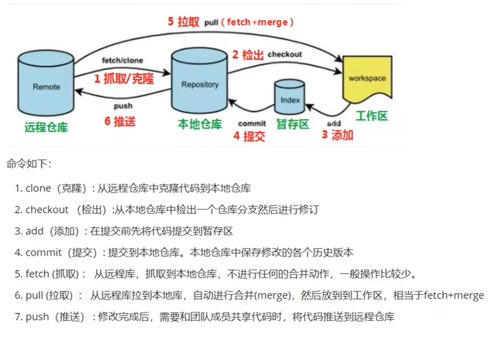

# Git Learning Guide

## 目錄

1. [基礎概念](basic-concepts.md)

   - Git 工作流程圖解
   - 基本術語說明
     - 工作區
     - 暫存區
     - 本地倉庫
     - 遠程倉庫

2. [基礎操作](basic-operations.md)

   - git config 配置管理
   - git init 倉庫初始化
   - git add/status 文件管理
   - git commit 提交更改
   - git log/reset/reflog 版本控制
   - .gitignore 忽略文件配置

3. [分支管理](branch-management.md)

   - 分支基本操作
   - Cherry-Pick 操作
   - Rebase 操作
   - 衝突處理

4. [Git Flow 工作流程](git-flow.md)

   - master/main 分支
   - develop 分支
   - feature 分支
   - hotfix 分支
   - release 分支

5. [遠端操作](remote-operations.md)

   - SSH 金鑰配置
   - 遠程倉庫配置
   - 推送和拉取操作
   - 遠程分支管理
   - 最佳實踐建議

6. [工作實務](work-practices.md)

   - 提交規範
   - 日常工作流程
   - Code Review 規範
   - 版本發布流程

7. [補充工具](tools-and-tips.md)
   - Git Bash 配置
   - Linux 常用命令
   - Git Bash 實用技巧

## 使用說明

本指南分為七個主要部分，每個部分都包含了相關的詳細說明和實用範例。您可以：

1. 按順序學習：從基礎概念開始，逐步深入
2. 選擇性學習：直接點擊感興趣的主題
3. 實用參考：將此指南作為日常工作的參考手冊

## 圖解概念

## 貢獻指南

歡迎提供改進建議和內容補充，請遵循以下步驟：

1. Fork 本專案
2. 創建新的分支
3. 提交您的修改
4. 發送 Pull Request

## 授權說明

MIT License
