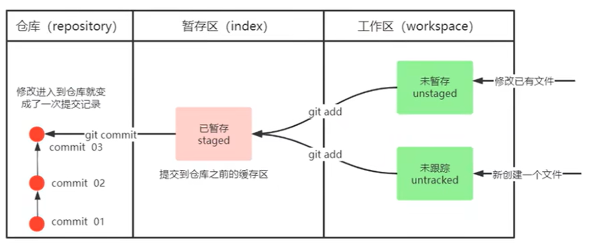

# Git 基礎概念

## 工作流程圖解

## 基本術語說明

1. **工作區（Working Directory）**

   - 實際操作的目錄，包含項目的所有文件

2. **暫存區（Staging Area）**

   - 臨時存放待提交的修改
   - 也稱為索引（index）

3. **本地倉庫（Local Repository）**

   - 保存項目的所有版本信息
   - 位於 .git 目錄下

4. **遠程倉庫（Remote Repository）**
   - 位於伺服器的倉庫
   - 用於多人協作
