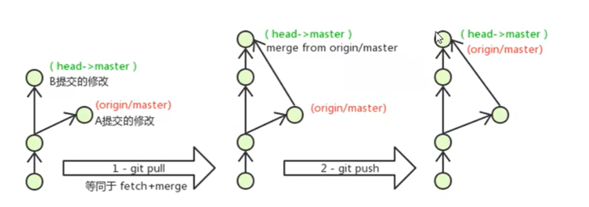

# Git 分支管理

## 1. 基本操作

### 查看分支

- `git branch` : 查看本地分支
- `git branch -r` : 查看遠程分支
- `git branch -a` : 查看所有分支

### 創建和切換

- `git branch <分支名稱>` : 創建本地分支
- `git branch -m <新分支名>` : 重命名當前分支
- `git branch -m <舊分支名> <新分支名>` : 重命名指定分支
- `git branch -M <新分支名>` : 強制重命名
- `git switch <分支名稱>` : 切換分支（推薦）
  - 舊命令：`git checkout <分支名稱>`
- `git switch -c <分支名稱>` : 創建並切換
  - 舊命令：`git checkout -b <分支名稱>`

### 合併和刪除

- `git merge <分支名稱>` : 合併分支
  - `git merge --no-ff <分支名稱>` : 創建合併提交
- `git branch -d <分支名稱>` : 刪除分支（需要檢查）
- `git branch -D <分支名稱>` : 強制刪除分支

### 文件操作

- `git restore <文件名>` : 恢復文件修改
- `git restore --staged <文件名>` : 取消暫存

## 2. Cherry-Pick 操作

Cherry-pick 允許選擇性地將特定提交應用到其他分支。

### 基本用法

- `git cherry-pick <commitID>` : 將指定提交應用到當前分支
- `git cherry-pick <commitA>..<commitB>` : 應用一系列提交（不包含 commitA）
- `git cherry-pick <commitA>^..<commitB>` : 應用一系列提交（包含 commitA）

### 常用選項

- `git cherry-pick -n <commitID>` : 只修改文件但不提交
- `git cherry-pick --continue` : 解決衝突後繼續
- `git cherry-pick --abort` : 取消整個操作
- `git cherry-pick --skip` : 跳過當前提交

### 使用場景

1. 將 hotfix 從維護分支移植到開發分支
2. 將特定功能從一個分支選擇性地合併到另一個分支
3. 恢復之前版本中的特定更改
4. 在不同版本分支間共享特定修改

## 3. Rebase 操作

Rebase 用於改變提交的基礎點，可以讓提交歷史更加整潔。

### 基本用法

- `git rebase <目標分支>` : 將當前分支的提交變基到目標分支
- `git rebase -i <commitID>` : 互動式變基
- `git rebase --onto <新基礎> <舊基礎> <分支>` : 將特定範圍的提交變基到新位置

### 互動式 rebase 選項

```bash
pick   p # 保留該提交
reword r # 保留提交，但修改提交信息
edit   e # 保留提交，但暫停修改
squash s # 將提交合併到前一個提交
fixup  f # 將提交合併到前一個提交，但丟棄提交信息
drop   d # 刪除該提交
```

### 注意事項

> _警告：rebase 會改變提交歷史，只能用於尚未推送到遠程的提交_

## 4. 衝突處理

### 衝突情境



當兩個分支對同一文件的相同部分進行修改時會產生衝突。

### 解決方法

1. 手動解決

```bash
<<<<<<< HEAD
當前分支的內容
=======
要合併分支的內容
>>>>>>> 分支名稱
```

- 打開衝突文件，找到衝突標記
- 選擇要保留的內容，刪除標記
- `git add <衝突文件>`
- `git commit` 完成合併

2. 使用合併工具

- 配置合併工具（VS Code, Beyond Compare 等）
- `git mergetool` 啟動工具
- 在界面中解決衝突
- `git commit` 完成合併

3. 取消合併

- `git merge --abort` : 取消當前合併，恢復到之前狀態
