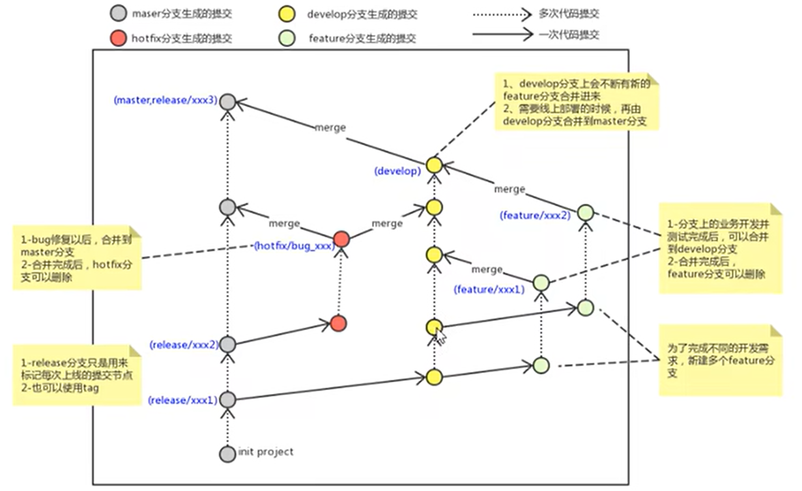

# Git Flow 工作流程

## 分支類型

### 1. master（main）分支

- 主分支，存放穩定的生產版本
- 只能從其他分支合併，不能直接開發

### 2. develop 分支

- 開發主分支，從 master 創建
- 包含所有開發完成的功能
- 經過測試後合併回 master

### 3. feature 分支

- 命名規範：`feature/功能名`
- 從 develop 分支創建
- 用於開發新功能
- 完成後合併回 develop

### 4. hotfix 分支

- 命名規範：`hotfix/問題描述`
- 從 master 創建
- 用於修復生產環境的緊急問題
- 完成後先合併到 develop 進行測試，確認無誤後再合併到 master

### 5. release 分支

- 命名規範：`release/版本號`
- 從 develop 創建
- 用於版本發布前的準備工作
- 完成後合併到 master 和 develop
